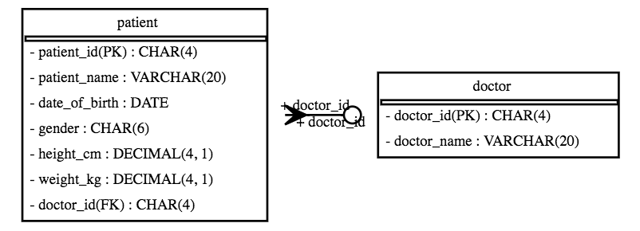

# ipython_magic_sqlalchemy_schemadisplay
Magic for [sqlalchemy_schemadisplay](https://github.com/fschulze/sqlalchemy_schemadisplay)

[](https://mybinder.org/v2/gh/innovationOUtside/ipython_magic_sqlalchemy_schemadisplay/master?filepath=notebooks/SchemaDemo.ipynb)

Magic originally created for the Open University module [TM351 Data Management and Analysis](http://www.open.ac.uk/courses/modules/tm351). This magic complements the [`ipython-sql`](https://github.com/catherinedevlin/ipython-sql), which provides magics for connecting to a SQL database, with a magic that uses [sqlalchemy_schemadisplay](https://github.com/fschulze/sqlalchemy_schemadisplay) to generate ERDs over a SQL database. *The code for generating the ER diagram can be found in the third party `sqlalchemy_schemadisplay` package.*

At the moment, the schema display and `ipython-sql` magics and independent, but they really should be combined into a single package.

## Usage

Install from PyPi: `pip install schemadisplay-magic`

Install from this repo:

`pip install git+https://github.com/innovationOUtside/ipython_magic_sqlalchemy_schemadisplay.git`

Note there are several other dependencies:

- Python: see *requirements.txt*
- O/S: see *apt.txt*

Set up a database. For example, load the SQL magic:

```python
%load_ext sql
```

Create a database connection string — we can use a SQLite database for demo purposes — and connect the SQL magic to the database:

```
DB_CONNECTION = 'sqlite:///./test.db'
%sql $DB_CONNECTION
```

Populate the database with a couple of foreign key related tables:

```
%%sql

DROP TABLE IF EXISTS doctor;

CREATE TABLE doctor (
    
    doctor_id CHAR(4),
    doctor_name VARCHAR(20),
    
    PRIMARY KEY (doctor_id)
 );

DROP TABLE IF EXISTS patient;

CREATE TABLE patient (
    
    patient_id CHAR(4),
    patient_name VARCHAR(20),
    date_of_birth DATE,
    gender CHAR(6),
    height_cm DECIMAL(4,1),
    weight_kg DECIMAL(4,1),
    doctor_id CHAR(4),
    
    PRIMARY KEY (patient_id),
    
    FOREIGN KEY (doctor_id) REFERENCES doctor
 );
 
```

Load the schema display magic, and render the schema from the connected database:
```python
%load_ext schemadisplay_magic
%schema --connection_string $DB_CONNECTION
```



At the moment, the database connection string needs to be provided to the schem magic for each diagram. [TO DO - fix this to use a single persistemt connection for the life of the notebook session, once connected.]


## Using the Magic in a Teaching and Learning Context

The magic was developed to support teaching and learning around the topic of *relational databases*. Students were working with a PostgreSQL database, creating, editing and deleting tables, and creating foreign key relationships between tables. The magic provided an easy way to visualise the current state of the tables available in the database, and any foreign key relationships between them.

In this way, students could run database and table modifying statements in a notebook. A single line magic invocation could then be used to generate a visual representation of the current state of the database to check that their intended changes had worked correctly.
